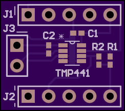
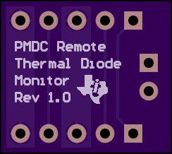
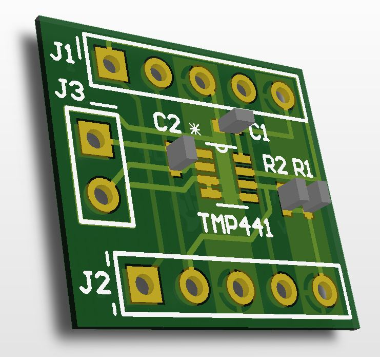
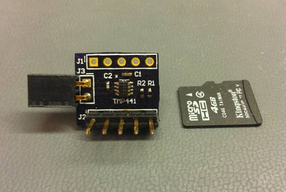
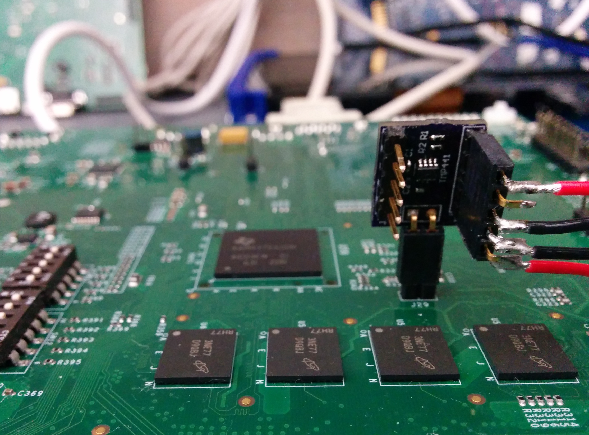

rtdc
====




The Remote Temperature Daughter Card (RTDC) uses a TMP441 to monitor the temperature of a remote thermal diode. By using a sequential current excitation, the RTDC can extract a differential VBE on the transistor and calculate its junction temperature. The TMP441 has features to improve measurement accuracy such as beta compensation, series resistance cancellation, and ideality factor correction. Communication is done over an I2C bus, with the RTDC having breakouts for the Power Measurement Daughter Card (PMDC) or any other I2C master such as the BeagleBone Black.



This repository includes:
- Altium library, schematic, and board files
- PCB gerbers and drill files
- Bill of materials
- Linux device driver and bash shell scripts
- C code for integrating with the PMDC MSP430 source code
- Misc. Documentation

<h1> Using the RTDC with the BeagleBone Black to measure AM437x Junction Temperature </h1>
The RTDC needs a 4-wire cable to interface with the BeagleBone Black. This cable connects the RTDC's power, ground, and I2C signals to the BeagleBone's P9 expansion header.

The AM437x contains a GND collector-connected PNP transistor, which can be used as a thermal diode to estimate junction temperature. The RTDC plugs directly into header pins on each test platform. Be sure to align the polarity of the TEMP_DIODE signals with the RTDC's J3 receptacle; TEMP_DIODE_P is pin 1. For the GP EVM, the connecting header is J29.

It should look something like this:



<h1>Script</h1>
Boot an Arago image on the BeagleBone Black and run the "tmp441_comp.sh" script. It will print remote temperature measurements in Celsius indefinitely, until a SIGINT occurs. This script also enables the beta compensation, series resistance cancellation, and ideality factor correction features of the TMP441.

```bash
root@beaglebone:~# ./tmp441_comp.sh

Taking temperature measurements...
Remote Temp (C):  32.2750
Remote Temp (C):  32.3125
Remote Temp (C):  32.5000
```
